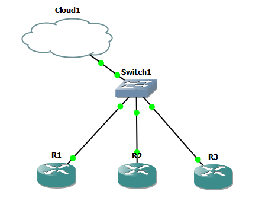

# Cisco NetOps Automation Suite

A Python-based Network Automation framework designed to configure, manage, and audit Cisco IOS devices at scale. This project demonstrates modern Network Programmability concepts using **Netmiko** for SSH interaction.

## 🏗️ Lab Topology


* **3x Cisco c7200 Routers** (Emulated via GNS3)
* **1x Ethernet Switch**
* **Management Network:** 192.168.206.0/24

## 🚀 Key Features

### 1. Connectivity Probe (`net_probe.py`)
* Automatically validates SSH connectivity and authentication for all devices in the inventory.
* Provides a quick health check summary before executing complex changes.

### 2. Configuration Backup Manager (`config_backup.py`)
* Connects to devices and pulls the full `running-config`.
* Archives configurations into a local directory with precise timestamps for version control.

### 3. OSPF Auto-Provisioning (`ospf_provision.py`)
* **Dynamic Logic:** Automatically generates Router-IDs and Loopback IP addresses based on the device's Management IP (last octet).
* Configures single-area OSPF (Area 0) and verifies adjacency readiness.
* Removes the need for manual, error-prone per-device configuration.

## 🛠️ Getting Started

### Prerequisites
* Python 3.x
* GNS3 (or physical lab)
* Netmiko Library

### Installation
1. Clone the repository:
   ```bash
   git clone [https://github.com/yourusername/Cisco-NetOps-Automation-Suite.git](https://github.com/yourusername/Cisco-NetOps-Automation-Suite.git)

2. Install dependencies:
   ```Bash
   pip install -r requirements.txt

3. Usage
   Run the scripts sequentially:
   ```Bash
   # Step 1: Check connectivity
   python net_probe.py

   # Step 2: Deploy OSPF configurations
   python ospf_provision.py

   # Step 3: Backup configurations
   python config_backup.py

📝 Inventory Format (inventory.csv)
   The project uses a CSV file to manage device credentials and IP addresses dynamically.

```Code snippet
   hostname,ip,device_type,username,password,secret
   R1,192.168.206.131,cisco_ios,admin,cisco,cisco
   R2,192.168.206.132,cisco_ios,admin,cisco,cisco
   R3,192.168.206.133,cisco_ios,admin,cisco,cisco


Created by E.M.S. EKANAYAKE - Faculty of Technology, University of Sri Jayewardenepura.
